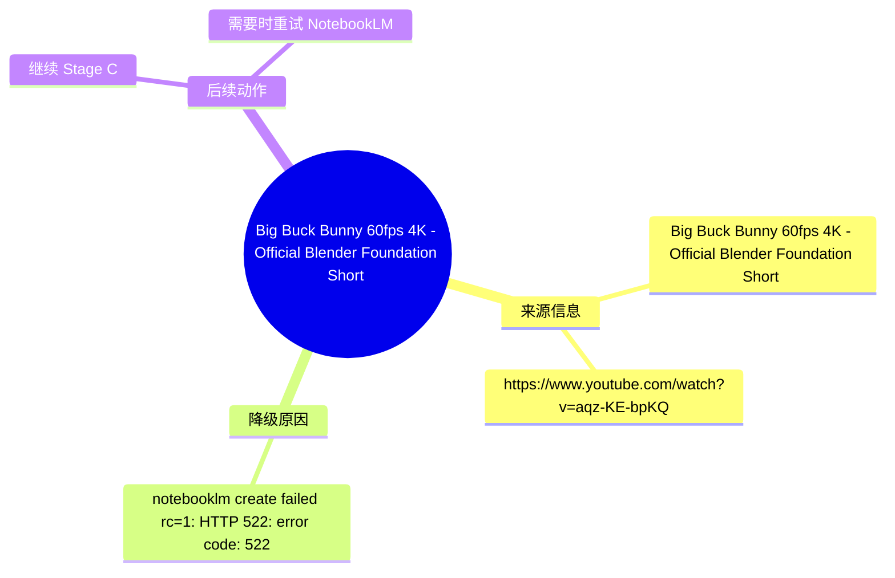

## 图谱（Obsidian 预览中打开）

```mermaid
mindmap
root((Big Buck Bunny 60fps 4K - Official Blender Foundation Short ))
  来源信息
    Big Buck Bunny 60fps 4K - Official Blender Foundation Short 
    https://www.youtube.com/watch?v=aqz-KE-bpKQ
  降级原因
    notebooklm create failed rc=1: HTTP 522: error code: 522
  后续动作
    继续 Stage C
    需要时重试 NotebookLM
```

## 与 Wiki 的链接

<!-- Stage C 完成后自动补充 wikilinks -->
