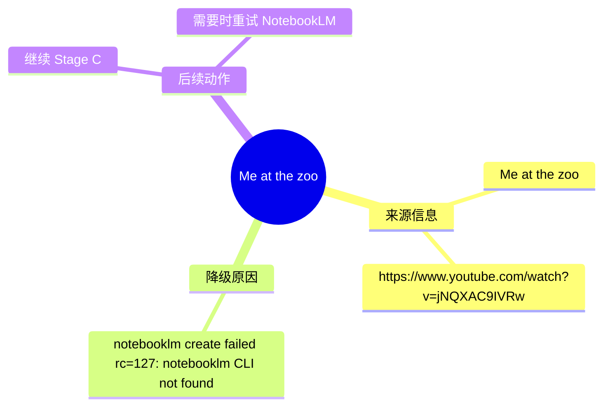

## 图谱（Obsidian 预览中打开）

```mermaid
mindmap
root((Me at the zoo))
  来源信息
    Me at the zoo
    https://www.youtube.com/watch?v=jNQXAC9IVRw
  降级原因
    notebooklm create failed rc=127: notebooklm CLI not found
  后续动作
    继续 Stage C
    需要时重试 NotebookLM
```

## 与 Wiki 的链接

<!-- Stage C 完成后自动补充 wikilinks -->
