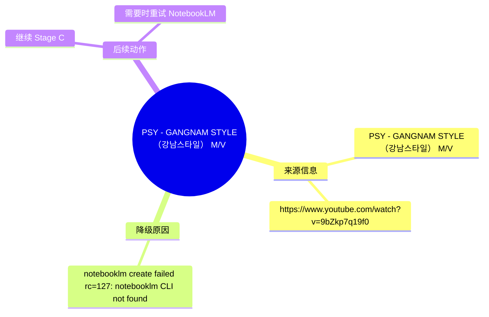

## 图谱（Obsidian 预览中打开）

```mermaid
mindmap
root((PSY - GANGNAM STYLE（강남스타일） M/V))
  来源信息
    PSY - GANGNAM STYLE（강남스타일） M/V
    https://www.youtube.com/watch?v=9bZkp7q19f0
  降级原因
    notebooklm create failed rc=127: notebooklm CLI not found
  后续动作
    继续 Stage C
    需要时重试 NotebookLM
```

## 与 Wiki 的链接

<!-- Stage C 完成后自动补充 wikilinks -->
